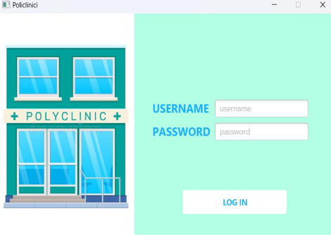
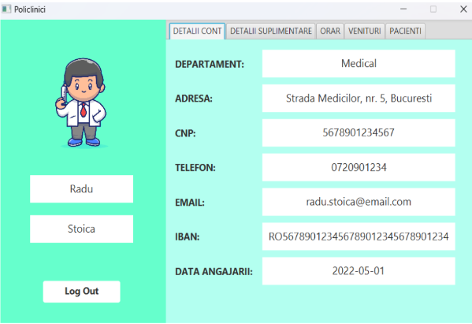
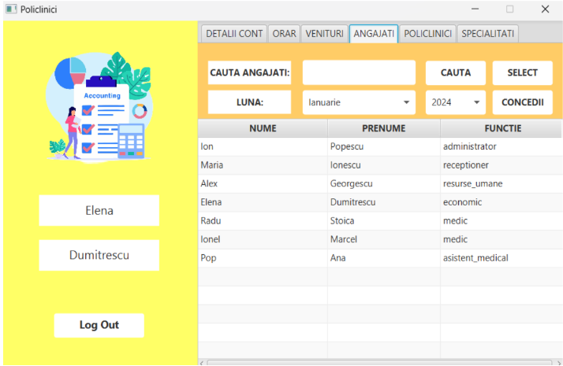

# 📌 Policlinic Management System  

This repository contains the implementation of a **policlinic management system**, developed as part of the *Introduction to Databases* course. The system is designed to streamline the management of medical clinics by offering an integrated solution for scheduling, financial operations, employee management, and medical records.  

## 📂 Features  

✔️ **User Roles & Permissions** – Includes Super-Admin, Administrator, Doctors, Assistants, HR, Accountants, and Receptionists, each with specific access rights.  
✔️ **Patient Management** – Allows scheduling, report generation, and medical data storage.  
✔️ **Financial Reports & Payroll** – Generates financial statements, salary calculations, and profit reports.  
✔️ **User Authentication & Security** – Role-based access control for secure data management.  
✔️ **Graphical Interface** – User-friendly UI built with JavaFX for smooth interaction.  
✔️ **Scalability** – The system is designed to handle multiple clinics in a centralized database.  

## 🛠️ Technologies Used  

- **Database:** MySQL (relational database for structured medical and financial data storage).  
- **Backend:** Java (object-oriented programming language for system logic).  
- **Frontend:** JavaFX (modern GUI framework for desktop applications).  
